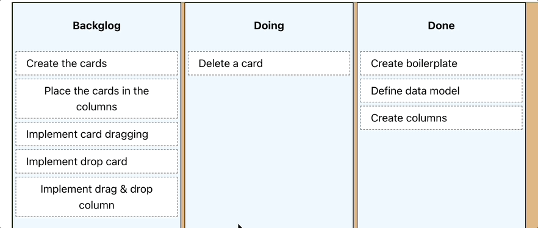

# 05 Fine tune drop

Ya tenemos un kanban muy básico, vamos a empezar a afinarlo (esto se puede llevar el 80% del tiempo de desarrollo de un proyecto :)).

Ahora mismo cuando soltamos la carta, no estamos muy seguros de donde se va a soltar ¿Encima del card? ¿Debajo?

Como primer paso vamos a mostrar una _carta fantasma_ indicando la posición en la que se va a colocar, más adelante podríamos plantear tener una zona de la carta (superior) para que la carta se coloque encima y otra zona (inferior) para que se coloque debajo.



> Si estás buscando una solución más refinada, puedes consultar la solución de separador de línea en los [Ejemplos de pragmatic drag an drop](https://atlassian.design/components/pragmatic-drag-and-drop/examples/). Si quieres que implementemos este separador paso a paso, por favor abre un issue y estaremos encantados de agregarlo.

## Paso a paso

Partimos del ejemplo anterior, lo copiamos, instalamos dependencias y ejecutamos el proyecto.

```bash
npm install
```

```bash
npm run dev
```

Para mostrar la _carta fantasma_, nos vamos al componente card y si estamos en modo edición vamos a mostrar un hueco vacío, primero mostramos un texto simple:

_./src/kanban/components/card/card.component.tsx_

```diff
  return (
+   <>
+   {(isDraggedOver) ?
+    <div style={{}}>
+     Card will be dropped here !
+    </div>
+   : null
+   }
    <div
      ref={ref}
      className={classes.card}
      style={{
        opacity: dragging ? 0.4 : 1,
        background: isDraggedOver ? "lightblue" : "white",
      }}
    >
      {content.title}
    </div>
+   </>
  );
```

Ahora podemos crear un card fantasma más realista, para ello vamos a crear un nuevo componente _ghost-card_ que se encargará de mostrar la _carta fantasma_.

_./src/kanban/components/ghost-card/ghost-card.component.module.css_

```css
.card {
  display: flex;
  border: 1px dashed gray; /* TODO: review sizes, colors...*/
  padding: 5px 15px;
  background-color: gray;
  width: 210px;
}
```

_./src/kanban/components/ghost-card/ghost-card.component.tsx_

```tsx
import React from "react";
import classes from "./ghost-card.component.module.css";

interface Props {
  show: boolean;
}

export const GhostCard: React.FC<Props> = ({ show }) => {
  return show ? <div className={classes.card}></div> : null;
};
```

Y vamos a reemplazarlo en nuestro componente card.

_./src/kanban/components/card/card.component.tsx_

```diff
+ import { GhostCard } from "../ghost-card/ghost-card.component";
// (...)

  return (
    <>
-      {isDraggedOver ? <div style={{}}>Card will be dropped here !</div> : null}
+      <GhostCard show={isDraggedOver} />
      <div
        ref={ref}
        className={classes.card}
        style={{
          opacity: dragging ? 0.4 : 1,
          background: isDraggedOver ? "lightblue" : "white",
        }}
      >
        {content.title}
      </div>
    </>
  );
```

Nos queda la parte de abajo, el _empty-space-drop-zone_

_./src/kanban/components/empty-space-drop-zone/empty-space-drop-zone.component.tsx_

```diff
- import { useEffect, useRef } from "react";
+ import { useEffect, useRef, useState } from "react";
+ import { GhostCard } from "./ghost-card/ghost-card.component";

export const EmptySpaceDropZone: React.FC<Props> = (props) => {
  const { columnId } = props;
  const ref = useRef(null);
+  const [isDraggedOver, setIsDraggedOver] = useState(false);

  useEffect(() => {
    const el = ref.current;
    invariant(el);

    return dropTargetForElements({
      element: el,
      getData: () => ({ columnId, cardId: -1 }),
+      onDragEnter: () => setIsDraggedOver(true),
+      onDragLeave: () => setIsDraggedOver(false),
+      onDrop: () => setIsDraggedOver(false),
    });
  }, []);

  return (
+   <div
+     ref={ref}
+     style={{ flexGrow: 1, width: "100%", background: "transparent" }}
+   >
+     <GhostCard show={isDraggedOver} />
-    <div
-        ref={ref}
-        style={{ flexGrow: 1, width: "100%", background: "transparent" }}
-     />
+   </div>
  );
};
```
