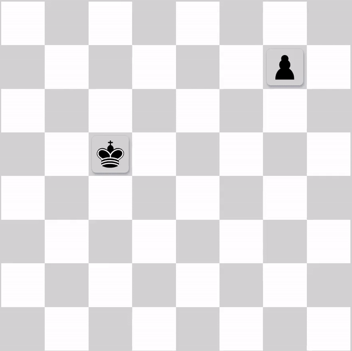

# Step 3: Moving the pieces

Finally let's allow the pieces to move squares when dropped. To achieve this we will use a monitorForElements from Pragmatic drag and drop.

Monitors allow you to observe drag and drop interactions from anywhere in your codebase. This allows them to recieve draggable and drop target data and perform operations without needing state to be passed from components.

Therefore we can place a monitor within a useEffect at the top level of our chessboard and listen for when pieces are dropped into squares.

To achieve this we first need to surface the location of the squares within the drop target, as we did for the draggable pieces in the previous step:



_./src/board/components/square.component.tsx_

```diff
  const ref = useRef(null);
  const [state, setState] = useState<HoveredState>("idle");

  useEffect(() => {
    const el = ref.current;
    invariant(el);

    return dropTargetForElements({
      element: el,
+     getData: () => ({ location }),
      canDrop: ({ source }) => {
```

We then add a monitor to the chessboard. Much of this logic mirrors the logic explained above for coloring squares.

_./src/board.component.tsx_

```diff
+ import { useEffect, useState } from "react";
+ import { monitorForElements } from "@atlaskit/pragmatic-drag-and-drop/element/adapter";
import { PieceRecord } from "./board.model";
import { renderSquares } from "./components";
import styles from "./board.module.css";
+ import { canMove, isCoord, isEqualCoord, isPieceType } from "./board.utils";

export function Chessboard() {
-  const pieces: PieceRecord[] = [
-    { type: "king", location: [3, 2] },
-    { type: "pawn", location: [1, 6] },
-  ];
+  const [pieces, setPieces] = useState<PieceRecord[]>([
+    { type: 'king', location: [3, 2] },
+    { type: 'pawn', location: [1, 6] },
+  ]);

+  useEffect(() => {
+      return monitorForElements({
+        onDrop({ source, location }) {
+          const destination = location.current.dropTargets[0];
+          if (!destination) {
+            // if dropped outside of any drop targets
+            return;
+          }
+          const destinationLocation = destination.data.location;
+          const sourceLocation = source.data.location;
+          const pieceType = source.data.pieceType;
+
+          if (
+            // type guarding
+            !isCoord(destinationLocation) ||
+            !isCoord(sourceLocation) ||
+            !isPieceType(pieceType)
+          ) {
+            return;
+          }
+
+          const piece = pieces.find(p =>
+            isEqualCoord(p.location, sourceLocation),
+          );
+          const restOfPieces = pieces.filter(p => p !== piece);
+
+          if (
+            canMove(sourceLocation, destinationLocation, pieceType, pieces) &&
+            piece !== undefined
+          ) {
+            // moving the piece!
+            setPieces([
+              { type: piece.type, location: destinationLocation },
+              ...restOfPieces,
+            ]);
+          }
+        },
+      });
+    }, [pieces]);

  return <div className={styles.board}>{renderSquares(pieces)}</div>;
}
```
